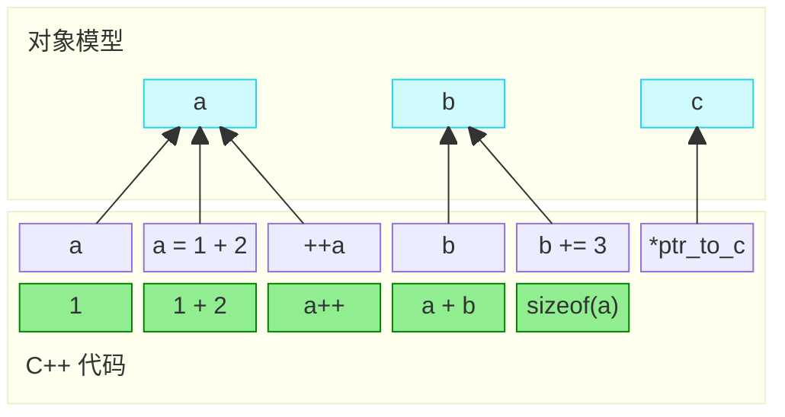

# 表达式与对象

表达式是 C++ 代码中的一种结构，通常用来指代一系列计算。表达式总是具有两个属性：
- 类型
- 值类别

值类别可将 C++ 的表达式分为两大类：泛左值（glvalue）和纯右值（rvalue）。这两类表达式的区别在于：

- 泛左值表达式总是指代一个**对象**。
- 纯右值表达式可以计算出一个**值**。

那么什么是“对象”？对象就是在 C++ 程序中，具有创建、存储、释放语义的东西。不要和“面向对象编程”中的“对象”混淆；这里说的对象是指所有具有存储性质的东西，比如 `int` 类型的变量，都可以称为对象。

什么是“值”？说实话，这个反而不好解释。我们就用含糊的语言来说吧：
- 值是对象的状态。任何对象在某一时刻都有一个值。
- 值可以作为操作数，或者用来初始化对象。

我们观察一下表达式在 C++ 代码中的运用。其实大部分表达式都是在做“作为操作数或者初始化对象”这件事，比如：

```cpp
int a = 1 + 2;
// 表达式 1 用来做操作数
// 表达式 2 用来做操作数
// 表达式 1 + 2 用来初始化对象 a
```

虽然之前的分类中说，纯右值表达式可以计算出值，但是泛左值也可以——只是泛左值计算出值，是通过泛左值指代的对象的状态作为值。

```cpp
int c = a + 1;
// 泛左值 a 指代对象 a
// 但是 a 具有值 3
// 所以这里表达式 a 计算出值 3
```

> 在期望值的语境（即作为语义上不需要对象参与的操作数，或者初始化对象的时候）出现泛左值表达式，会取出对象的值来运算，这种行为叫做 *左值到右值转换*。

我们再次重申一下这个抽象的框架：表达式分为两大类；泛左值表达式总是关联对象，对象具有值；纯右值表达式不关联对象，可以直接通过表达式本身计算出一个值。



上面这张图演示了本篇所要讲述的要点。假设我们的代码中存在 `a` `a = 1 + 2` `++a` ... `sizeof(a)` 等这么多个表达式，那么：
- 其中的泛左值表达式 `a` `++a` 等都关联到对象 `a` 上（因此这些表达式出现在赋值运算符左侧时，具有相同的语义。）泛左值表达式 `b` `b += 3` 则都关联到对象 `b` 上。`ptr_to_c` 作为指针类型，对其解引用也会得到关联到某个对象 `c` 的泛左值表达式。
- 用绿色框标出的表达式 `1` `a++` `a+b` 等则是纯右值表达式，它们不关联到对象上，只能计算出一个值。（因此，这些表达式默认也无法出现在赋值运算符左侧。）

## 注释

- 泛左值表达式还可以指代函数，我们为了讨论方便没有说这件事。
- 本篇提到的所有的“作为操作数”、“赋值运算符”都不含重载运算符的情形。
