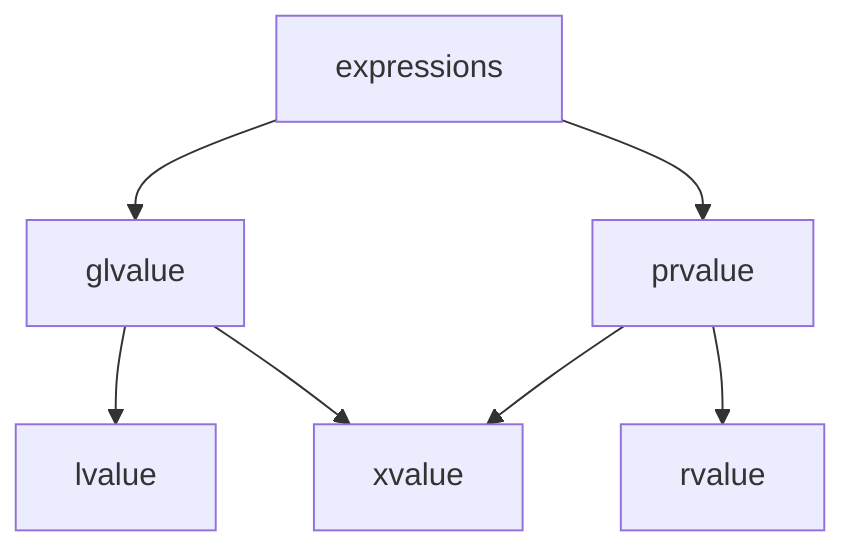

# 左值、右值、引用

在本篇开头，我们先回顾引用的概念。 C++ 中声明一个引用，是在给**对象**起一个**名字**。注意是“对象”。因此，任何引用引入的名字，都指代一个对象。因此，**引用名作为表达式，必然是泛左值**。这个结论基础但很重要。

## 左值和右值

引用分为两种，左值引用和右值引用。为了介绍这两种引用的区别，就需要正式引入**左值**和**右值**的概念了。我这样介绍它们：

- 所有纯右值都是右值（rvalue）；
- 大部分泛左值都是左值（lvalue）；除非它们是临时量实质化得到的，或者程序员刻意地做了转换；
- 那些不是泛左值的左值，称为**亡值**（xvalue）。

那么你现在可以知道，临时量实质化就是纯右值到亡值的转换，但是这一转换仍然在右值的范畴内。好吧，这个时候我们终于可以上这张经典老图了：



那么，为什么 C++ 要将临时量实质化出来的泛左值单划一类叫亡值呢？嘛，字面意义上很好理解——因为这些泛左值表达式所指代的对象，马上就死**亡**了——也就是释放、析构了。这是我们在分析临时对象的生命周期时讲到的特点。

事实上，C++ 也正是意图**基于生命周期长短来区分左值和右值**（亡值）的。那些指代生命周期很短的对象的表达式，被划分到右值（亡值）；那些生命周期较长且还能允许稍后再访问的对象，指代它们的表达式就是左值。

来看几个右值的例子： `S{}`、`1 + 2`、不返回引用类型的函数调用。这些是纯右值表达式；它们一辈子就只能用来做临时量实质化——然后实质化后也只能在全表达式结束后立即释放。所以，这些短命的可怜鬼都是右值。至于 `S{}.mem`，`.mem` 指代的子对象的生命周期跟着 `S{}` 纯右值走，`S{}` 很快释放那 `S{}.mem` 也很快释放。所以它也是右值。

另一方面，变量名作为表达式是左值表达式。因为变量名所引入的，是指代先前声明的对象的，这个对象在变量名的作用域内会一直存在，并不是像临时对象那样在全表达式完成后就释放的。类似地，`a = b`、`++a` 指代的也是变量 `a` 声明时引入的对象。

随后，我们可以进一步推进文章开头的结论，**引用名作为表达式不仅一定是泛左值，而且一定是左值**。因为引用延长了被绑定表达式的对象的生命周期，因此原本实质化的“临时”对象也变得和普通变量一样长寿了。那么，通过引用名使用的这些对象，也具有左值的“长生命周期”特征。

我们可以观察到两个有趣的事实：
- 左值表达式可以出现在赋值运算符左侧，而右值不行。因为对右值赋值是没意义的，它们马上就死了还赋值干嘛。
- 左值表达式可以取地址，右值表达式不行。取地址运算符取得的是对象在内存中的位置；纯右值没有关联对象自然不能取；亡值关联的对象马上就释放，其地址值获取到了也没意义。

## 左值引用和右值引用

好；接下来我们正式地介绍**左值引用**和**右值引用**。有了前面的铺垫，这实在是太简单了：
- 左值引用（lvalue reference）通常只能从左值表达式初始化，它会绑定到该表达式所指代的对象的引用；
- 右值引用（rvalue reference）只能从亡值（右值）表达式初始化，它会绑定到该表达式所指代的（临时）对象的引用。

为什么“不能”从纯右值初始化引用？——复习一下临时量实质化，在绑定到引用之前就已经转换到亡值了。本文剩下的部分姑且不区分纯右值和亡值，毕竟前者就就是使用时多一个实质化而已。

```cpp
int a;

int&  lvalue_ref = a;
int&& rvalue_ref = 1;

// 以下代码是错误：
// int&  lvalue_ref = 1;
// int&& rvalue_ref = a;
```

左值引用具有 `T& name` 声明符，右值引用具有 `T&& name` 声明符，所以写出来就是上面代码那样。`a` 是左值表达式，`1` 是右值表达式，反过来初始化会发生编译错误。

## 只读左值引用

特别地，如果左值引用声明为只读的，如 `const int& name = ...`，则它可以从任意类别的表达式初始化。

```cpp
const int& foo = a; // OK
const int& bar = 1; // 也 OK
```

这是因为在 C++11 之前没有右值引用，但是将右值绑定到引用是很常见的需求，因此规定了 `const T&` 可绑定右值，从而：

```cpp
struct S {};
S operator+(const S&, const S&);

int main() {
  S a, b, c;
  a + b + c; // <--
}
```
注意加法表达式的第二个加号，其左侧操作数是右值表达式 `a + b`，右侧操作数是左值表达式 `c`，然后 `operator+` 两个操作数都声明为 `const S&`，才能统统传进来。即便 `a + (b + c)` 这样左右值顺序调换一下，如此定义的 `operator+` 也能应付得了。

有了右值引用之后，人们就不倾向于使用 `const T&` 这种“通用引用”来一起应付传入的左右值类别，而是使用模板。因为库使用者出于一些理由（“保持移动语义”）希望知道传进来的表达式之前到底是什么值类别的。毕竟，`const T&` 的实现只会得到左值——再次重申，任何引用作为表达式，只能是左值。我们在后面的章节会提到基于模板的“万能引用”。

## 注释

- 本文中的“除非”是英文 unless 的语义，而非传统上的“除非……否则”语义。
- 本文中出现的“赋值运算符”和“取地址运算符”不考虑运算符重载。如 `std::string::operator=(const std::string&);` 这种 C++11 之前定义的赋值运算符重载不符合相关描述，且后来出于兼容性考虑也没有修复它们。
